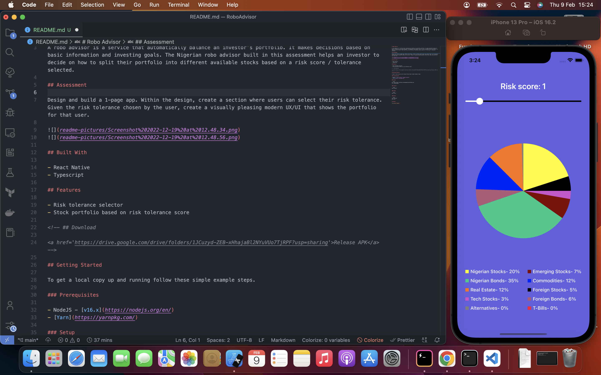

# Robo Advisor

A robo advisor is a service that automatically balance an investor’s portfolio. It makes decisions based on basic information and investing goals. The Nigerian robo advisor built in this assessment helps an investor to decide on how to split their portfolio into different available stocks based on a risk score / tolerance selected.

## Assessment

Design and build a 1-page app. Within the design, create a section where users can select their risk tolerance. Given the risk tolerance chosen by the user, create a visually pleasing modern UX/UI that shows the portfolio for that user.



## Built With

- React Native
- Typescript

## Features

- Risk tolerance selector
- Stock portfolio based on risk tolerance score

<!-- ## Download

<a href='https://drive.google.com/drive/folders/1JCuzyd-ZEB-xHhajaBl2NYuVUo7TjRPF?usp=sharing'>Release APK</a> -->

## Getting Started

To get a local copy up and running follow these simple example steps.

### Prerequisites

- NodeJS - [v16.x](https://nodejs.org/en/)
- [Yarn](https://yarnpkg.com/)

### Setup

```bash
git clone https://github.com/omodauda/ContactBook.git
cd ./ContactBook
```

### Install

```bash
yarn install
```

### Usage

```bash
yarn start
```

### Build

```bash
yarn android
yarn ios
```

## Author

👤 **Lawal Dauda**
